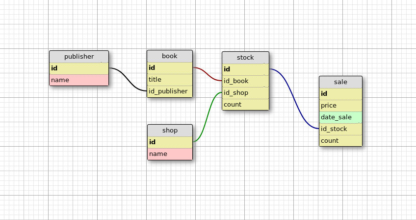

### Задание 1

Напишите ORM-классы, используя библиотеку **wtdbo**, по схеме:

   

Интуитивно нужно выбрать подходящие типы и связи полей.

------

### Задание 2

Используя библиотеку **wtdbo**, составьте запрос выборки магазинов, продающих целевого издателя.

Напишите программу на C++, которая:

- подключается к PostgreSQL;
- создаёт все необходимые таблицы и связи между ними;
- заполняет таблицы тестовыми данными из С++ кода. Данные для заполнения выберите произвольно;
- выводит информацию об издателе (publisher), имя или идентификатор которого принимается через `std::cin`. Программа должна выводить список магазинов, в которых продают книги этого издателя.

------

